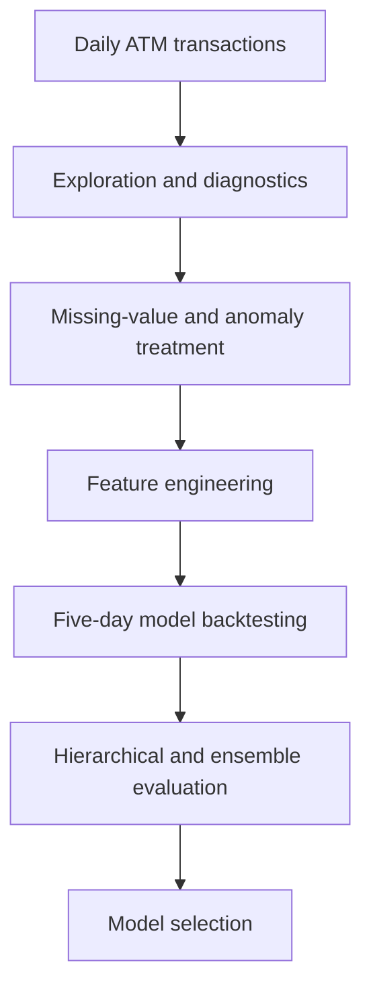

# ATM Cash Demand Forecasting


An end-to-end time-series forecasting project for estimating five-day ATM cash demand. The analysis compares statistical, machine-learning, hierarchical, recursive, direct, hybrid, and ensemble forecasting approaches using daily deposits, withdrawals, and net cash flow.

[Explore the complete notebook](./ATM_Cash_Demand_Forecasting.ipynb)

## Business problem

ATM operators must balance two competing risks:

- **Cash shortages**, which cause failed withdrawals and poor customer experience.
- **Excess cash**, which increases idle-capital and replenishment costs.

Reliable short-term forecasts can support better cash-loading decisions. This project evaluates whether deposits and withdrawals should be modeled jointly, separately, or through a reconciled hierarchy.

## Dataset

The project uses daily transaction data from an ATM in Turkey, covering **January 5, 2016 through March 31, 2019**. After removing four incomplete initial records, the working sample contains **1,182 daily observations**.

| Series | Meaning | Missing observations |
|---|---|---:|
| `CashIn` | Daily cash deposits | 101 |
| `CashOut` | Daily withdrawals, represented as negative values | 88 |
| `target` | Net cash flow: `CashIn + CashOut` | 110 |

The source data are downloaded directly in the notebook from the [`ml_se_seminars` repository](https://github.com/andrei-egorov/ml_se_seminars/blob/master/atm_daily_cash.csv).

## Project workflow



The notebook covers:

1. **Exploratory analysis** — missingness, descriptive statistics, temporal patterns, weekday effects, distributions, and correlations.
2. **ETNA dataset construction** — conversion of deposits, withdrawals, and net cash flow into a multi-segment `TSDataset`.
3. **Data-quality treatment** — seven-day seasonal imputation, mean fallback imputation, and local density-based anomaly detection.
4. **Time-series diagnostics** — ACF, PACF, STL decomposition, and periodogram analysis.
5. **Feature engineering** — lagged values, trend, calendar variables, salary-cycle proxies, and decomposition features.
6. **Model comparison** — Prophet, linear regression, CatBoost, recursive and direct pipelines, a hybrid strategy, and weighted voting.
7. **Hierarchical forecasting** — bottom-up reconciliation of deposits and withdrawals into a coherent net position.

## Feature engineering

The predictive feature set includes:

- Recent and weekly lag windows adapted to each forecasting strategy.
- Linear trend estimates.
- Day-of-week, day-of-month, week-of-month, week-of-year, and month indicators.
- Friday and weekend flags.
- Beginning- and mid-month salary-cycle proxies.
- STL-derived components for CatBoost models.
- Optional Turkish holiday indicators.

The periodogram shows prominent peaks near 12, 52, and 104 cycles per year, supporting the use of monthly, weekly, and half-weekly signals.

## Validation design

Models are evaluated using **three-fold rolling backtesting** over a **five-day forecast horizon**. MAE is the primary selection metric because net cash flow is signed and frequently approaches or crosses zero, making percentage-based metrics such as SMAPE unstable.

## Results

The table reports MAE averaged across the three backtest folds. Lower values are better.

| Model | `CashIn` MAE | `CashOut` MAE | Net-flow MAE |
|---|---:|---:|---:|
| Prophet | 13,647.48 | 12,842.02 | 14,257.11 |
| Prophet with preprocessing | **12,573.04** | 11,374.01 | 13,964.72 |
| CatBoost with weekly lag | 24,388.62 | 17,385.76 | 17,590.80 |
| Recursive linear | 12,596.49 | **7,785.50** | **13,410.67** |
| Direct CatBoost | 23,800.59 | 18,161.20 | 18,377.89 |
| Hybrid direct-recursive | 17,496.24 | 11,290.25 | 14,800.87 |
| Weighted voting ensemble | 13,621.99 | 7,937.76 | 13,614.26 |

The separate exploratory linear pipeline uses ETNA's default one-step horizon, so its metrics are excluded from this five-day comparison.

### Hierarchical reconciliation

Bottom-up hierarchical Prophet produces a coherent total forecast with a net-flow MAE of **14,273.47**. Reconciliation guarantees that component and aggregate forecasts agree, but it does not automatically improve predictive accuracy in this experiment.

## Key findings

- Preprocessing reduces Prophet MAE by **7.9%** for deposits, **11.4%** for withdrawals, and **2.1%** for net cash flow.
- Cleaned Prophet achieves the lowest deposit MAE, narrowly outperforming recursive linear forecasting by approximately 23 units.
- Recursive linear forecasting is the strongest overall five-day approach, producing the best withdrawal and net-flow forecasts.
- Direct CatBoost underperforms the simpler recursive specification on every segment.
- The hybrid and weighted-voting approaches recover much of CatBoost's performance gap, but neither surpasses recursive linear forecasting.
- Component series have different predictability, supporting segment-specific model selection rather than a single universal model.

## Recommended forecasting design

Based on the backtests, the strongest candidate design is:

- **Deposits:** preprocessed Prophet.
- **Withdrawals:** recursive linear forecasting.
- **Net cash flow:** recursive linear forecasting, or reconciliation of the selected component forecasts when accounting coherence is required.

In an operational deployment, model selection should go beyond MAE alone: forecasts should be monitored by segment and horizon and translated into cash-replenishment decisions using the asymmetric costs of shortages and excess idle cash.

## Installation

ETNA 3 currently requires **Python 3.10-3.12**. Python 3.12 is recommended for reproducing the notebook.

```bash
python -m venv .venv
source .venv/bin/activate
python -m pip install --upgrade pip
python -m pip install "ts-etna[prophet]" catboost gdown jupyter
```

On Windows, activate the environment with:

```powershell
.venv\Scripts\activate
```

Although the distribution is installed as `ts-etna`, it is imported in Python as `etna`. Restart the notebook kernel after installation.

## Running the project

1. Clone or download the repository.
2. Create and activate a Python 3.12 environment.
3. Install the dependencies above.
4. Open the notebook:

   ```bash
   jupyter notebook ATM_Cash_Demand_Forecasting.ipynb
   ```

5. Run the notebook from top to bottom. The dataset is downloaded automatically.

For Google Colab, select a runtime that uses Python 3.12 before installing the dependencies.

## Limitations and next steps

- The dataset represents one ATM, so performance may not generalize to a larger or more heterogeneous network.
- Three backtest folds provide a focused comparison but do not capture every seasonal regime.
- The evaluation measures forecast accuracy rather than the financial cost of shortages and excess cash.
- Calendar features approximate operational effects and could be strengthened with verified holidays, paydays, promotions, and service events.

Potential extensions include multi-ATM hierarchical forecasting, probabilistic prediction intervals, cost-sensitive model selection, automated hyperparameter tuning, and optimization of replenishment schedules.

## Tech stack

`Python` · `pandas` · `NumPy` · `ETNA` · `Prophet` В· `CatBoost` · `scikit-learn` · `statsmodels` · `Matplotlib` · `Seaborn` · `Plotly`

## Author

**Muhammad Murodzoda**

